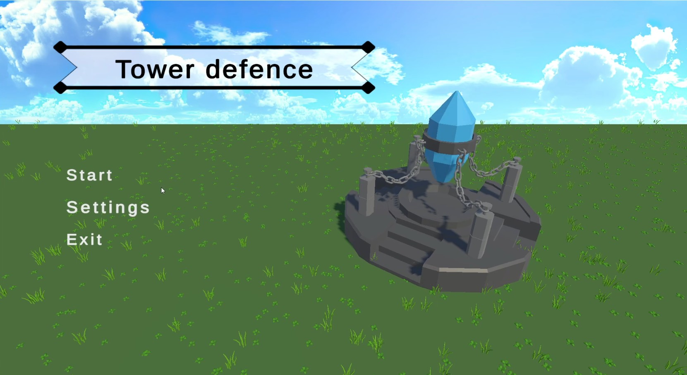
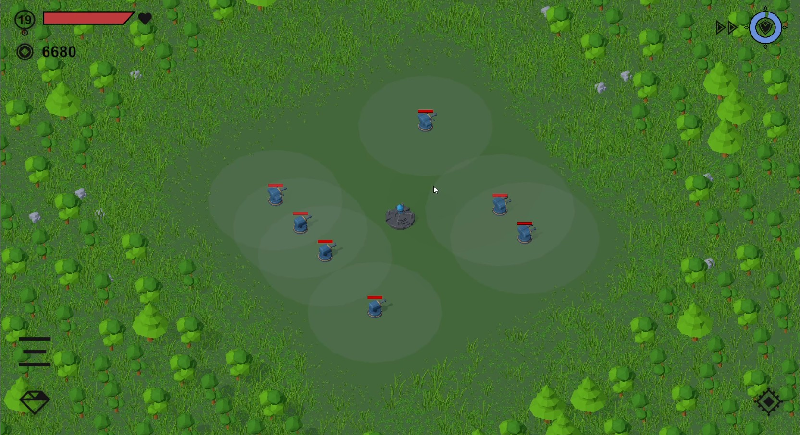
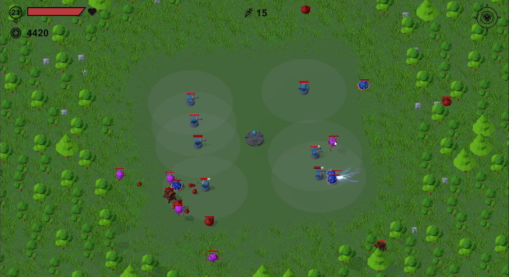
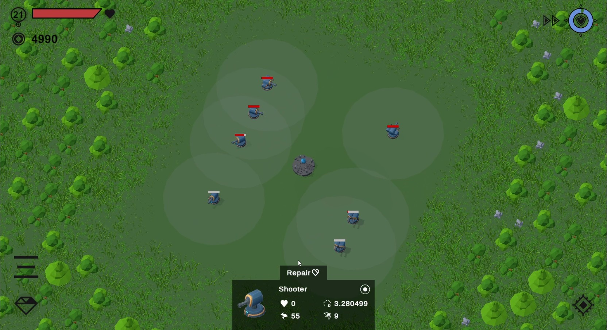
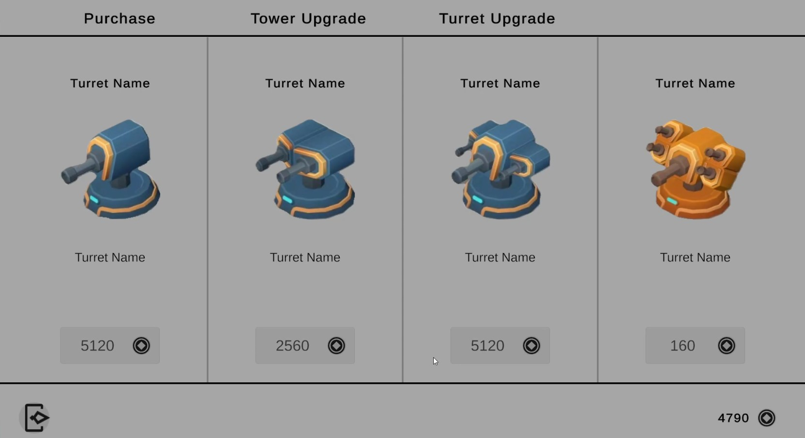
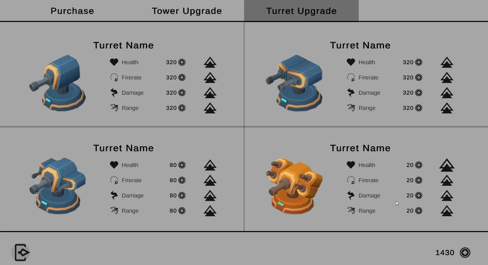
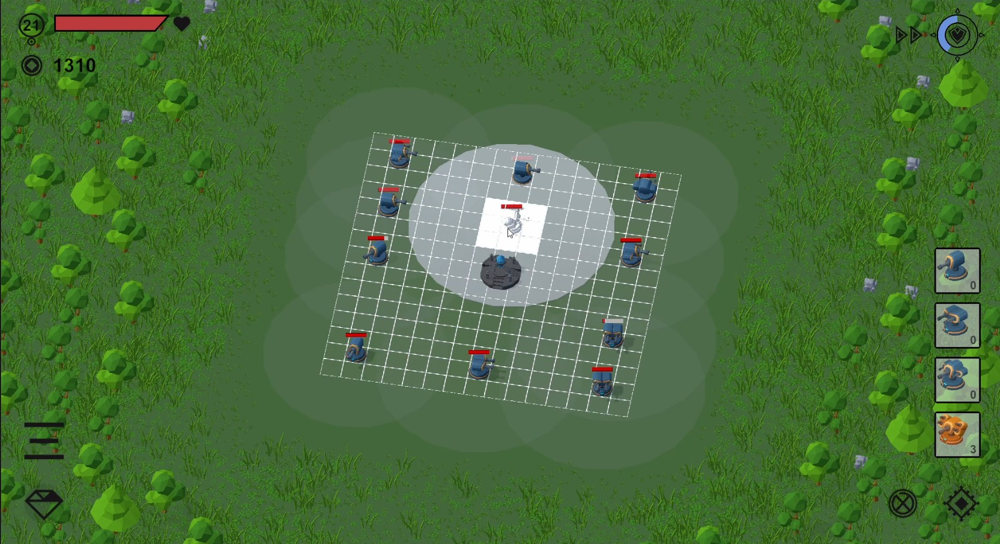
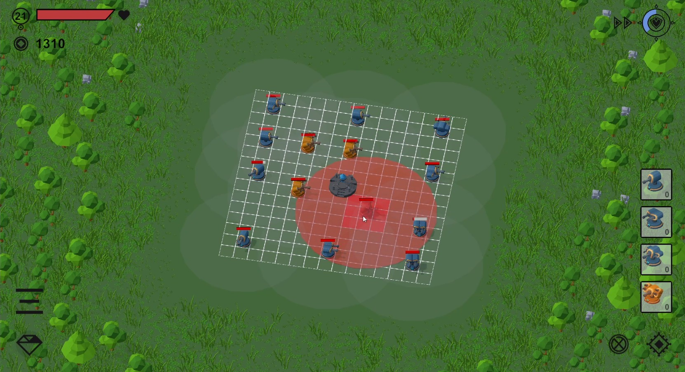
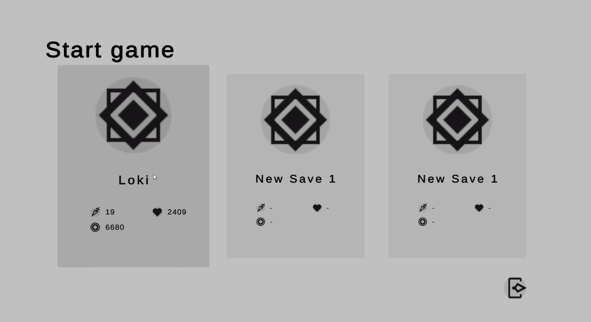

# 🎮 TOWER DEFENCE

<i>A simulation game where you build and defend your tower from enemies during waves.</i>

---

## 🕹️ About the Game

**TANK BATTLE** is a **Action, Simulation, Base defence** game developed using **Unity**.  

Tower defence is a simulation game where you need to build and defend your tower from enemies during waves. You can click to destroy or build different types of turrets to defend your tower.

**Why this project?**
- To practice building system and shop system.
- To learn game development patterns.

---

## ✨ Key Features

- 🔥 Building and Action for defending your base from different kinds of enemies.
- 🎯 Shop and upgrade system for turrets and tower.

---

## 🧠 Special Concepts Implemented

### 🧩 Concept 1: Building system using Grid
Used unity's grid system for the building system to defend against the base from the enemy waves.

### 🧩 Concept 2: Object pooling and Singleton
Used object pooling for enemy wave system and singleton pattern for game systems.

---

## 🛠️ Tech Stack

| Category | Technology |
|--------|------------|
| Engine | Unity 2022 |
| Language | C# |
| Tools | GitHub |
| Models | Unity assets |

---

## 🎮 Controls
    
#For PC:
| Action | Input |
|:------:|:------:|
| Rotate | Middle mouse drag |
| Destroy | Left click |

## 📸 Screenshots & GIFs

### Gameplay

  
  

  
  

  
  

  
  

---

## 🎥 Gameplay Video

👉 [Gameplay Trailer](https://youtu.be/8x9qAZr9wro)

---
